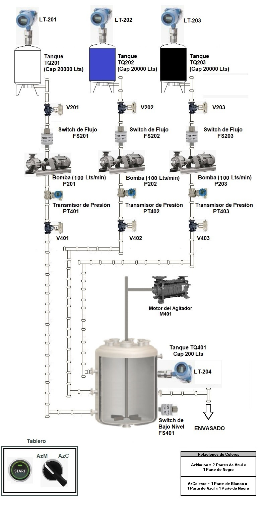

Usted ha sido contratado por Dupont, líder mundial en fabricación de pintura para el sector automotriz. Su Jefe, al revisar su curriculum, detecta que usted tiene conocimientos de programación en C++ y le solicita que programe el sistema de elaboración de las dos pinturas lideres para el mercado venezolano: Azul Marino (AzMarino) y Azul Celeste (AzCeleste).

El programa debe cumplir con las siguientes premisas:

1ro.- El proceso arranca por comando del tablero "Botón de arranque de mezcla" de Mezcla.

2do.- Cualquier bomba debe detenerse si: (1) el interruptor de flujo a la entrada de la válvula de descarga pasa a "Alarma" (2) si la presión a la descarga de la válvula pasa los 50 psi (3) La cantidad de pintura que debía bombear ya se encuentra en el mezclador.

3ro.- Cuando una bomba se encuentra trabajando con con la válvula de succión y descarga abierta su caudal de operación es de 100 lts/mi.

4to.- La presión a su descarga debe ubicarse alrededor de 33 psi si las válvulas a la entrada y a la salida se encuentran abiertas. Si en ese instante se cierra la válvula de descarga, el caudal inmediatamente cae a 0 (no pasa ninguna cantidad de base de pintura al tanque de mezclado). adicionalmente, la presión comienza a aumentar y al pasar los 50 psi la bomba se apaga por por sobre presión. Si la válvula se abre la presión desciende hasta 20 psi en donde la bomba arranca nuevamente y se estabiliza en 33 psi, al re-arrancar la bomba vuelve a enviar los 100 lts/min.

5to.- Cuando una bomba se encuentra trabajando a su caudal máximo de 100 lts/min y se activa el Switch de bajo Flujo (Alarma) la bomba debe apagarse de inmediato. La presión a la descarga debe descender a 0 psi si la válvula se encuentra abierta, si se encuentra cerrada la presión se mantiene en el último valor. Al recuperar el Switch de bajo Flujo su condición de funcionamiento (Normal), la bomba re-arrancará cuando la presión a la descarga baje por debajo de 20 psi y durante ese tiempo la presión se incrementará la presión hasta su nivel normal de operación alrededor de 33 psi.

6to.- Cuando se desea mezclar un tipo de pintura se debe garantizar que el tanque de mezclado reciba la cantidad correcta de las bases necesarias para obtener el color requerido. Por ejemplo si deseamos obtener Azul Marino (AzMarino), según la tabla la relación 2 partes de negro por cada parte de Azul. Como el Tanque destino tiene capacidad de 200 lts  pero los lotes se fabrican de 150 lts, por lo tanto debo prender la bomba P203 (Negro) el tiempo necesario para bombear 100 lts de Negro (60 segundos) y la Bomba P202 (Azul) el tiempo necesario para bombear 50 lts (30 segundos) de Azul. En pantalla debe mostrarse la cantidad de segundos en los cuales cada bomba aporta base de pintura al mezclador. No presentar estos contadores descalifican al programa entregado.

7mo.- Una vez bombeada la cantidad de base necesaria, se apagan las bombas de base de pintura y se enciende el motor de mezclado por 30 segundos.

8vo.- Si durante el proceso de bombeo se detiene alguna bomba por algún inconveniente, las otras bombas deben completar su proceso de bombeo. Si después de un tiempo la bomba que falló se recupera ella debe completar el bombeo de la base de pintura faltante para asegurar la mezcla. Solo cuando se haya terminado de bombear los 150 litros y se hayan apagado las bombas de base de pintura (P201, P202 y P203) es que se arrancara el motor de mezclado M401 por los 30 segundos estipulados.

9no.- El programa debe impedir que se arranque un nuevo lote de mezclado de pintura si el lote en curso no se ha completado. En caso de intentar arrancar el proceso nuevamente sin que el lote de preparación actual este completado, el programa deberá presentar un mensaje en pantalla que informe que el ultimo proceso de mezclado no se ha completado y la solicitud no será aceptada.

10mo.- Para que el proceso de mezcla pueda arrancar el interruptor de bajo nivel del mezclador debe estar en alarma, de lo contrario el sistema no aceptara el comando de arranque.

11vo.- Para que arranque la preparación de un nuevo lote de pintura es necesario que el interruptor de bajo nivel del mezclador este activado y que el botón de arranque se encuentre en OFF y pase a ON. Esta condición será verificada. Los procesos de elaboración de lotes no puede arrancar de forma automática.

Condiciones del Profesor:

- El Archivo de texto contendrá las Válvulas V201, V202, V203, V401, V402, V403,  el Color a mezclar (AzMarino / AzCeleste) y el comando de arranque de fabricación (ON/OFF); si este comando pasa a ON y el mezclador esta vacío se procederá a fabricar el lote de pintura definida según el Color a mezclar. Si durante el proceso de fabricación de un lote se coloca en OFF el comando de arranque, el proceso de fabricación en curso deberá completarse.
- Se debe indicar tiempo de funcionamiento de cada bomba en segundos y los transmisores de niveles de los tanques bases y el mezclador, de forma de verificar el funcionamiento del programa.
- Usted debe simular todos los elementos del esquema y su funcionamiento.
- Se debe monitorear todos los elementos  en pantalla.
una vez finalice el ciclo de mezclado el mezclador debe vaciarse a razón de 4% cada segundo (25 seg totales)

Condiciones Iniciales

- Los niveles de los tanques bases son de 25% el nivel del mezclador en 0%
- Los interruptores de Flujo en Normal.
- Todas las válvulas abiertas.
- Las bombas apagadas.
- Los transmisores de presión en 0 psi.
- El comando de arranque de fabricación en OFF.
- El selector de tipo de pintura en AzCeleste
